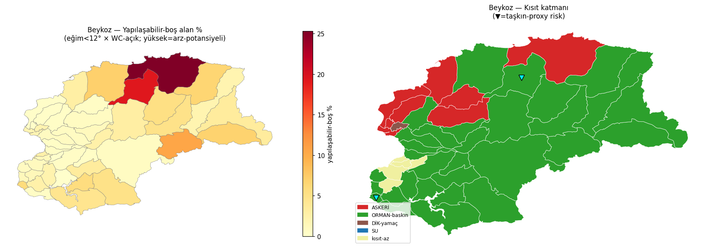

# BEYKOZ ARAZİ FORMU — FİZİKSEL TEMEL KATMANI · CC-TT-MAP MAP32

**Tarih:** 2026-07-27 · **Kaynak:** Copernicus-DEM GLO-30 (eğim/bakı/yükseklik) + ESA WorldCover (örtü) + OpenStreetMap (askeri/dere/kıyı) · **Kanon-dışı:** `nasa_kesif/`

## 🔵 FİZİK-SINIR BLOĞU (zorunlu)
- Eğim ∈ [0, 90]° · Yükseklik Beykoz 18-197m · Kıyı-mesafe ≥ 0
- **Kontrol:** eğim∈[0,90] yükseklik∈[0,250] kıyı≥0 — hepsi geçerli ✅ (tüm 45 mahalle fizik-sınır içinde; MAP31 NDVI>1 dersi uygulandı)

## ANA BULGU — arz-kıtlığının FİZİKSEL yarısı
- **Yapılaşabilir-boş alan ort %3.3** (medyan %1.9, max %25.3) → Beykoz'da düz+açık+kısıtsız arazi **çok az**.
- En-yüksek potansiyel Riva (%25,3) bile **ASKERİ-kısıtlı**. → **Fiziksel arz-kıtlığı GERÇEK** (orman-baskın + dik-yamaç + askeri).
- 8 mahalle askeri-kısıt, 37 mahalle orman-baskın, taşkın-proxy-risk: ['goksu', 'alibahadir']

## 45 MAHALLE TEK-SATIR TABLO

| Mahalle | Alan ha | Orman% | Yapılı% | Yapılaşabilir-boş% | Eğim° | Eğim0-5/5-12/12-20/20+ | Güney% | Kıyı km | Kısıt | Taşkın |
|---|---|---|---|---|---|---|---|---|---|---|
| riva | 2256 | 63.5 | 4.4 | 25.3 | 7.7 | 32/53/13/2 | 29.7 | 1.7 | ASKERİ+ORMAN-baskın | düşük |
| alibahadir | 1124 | 65.6 | 4.7 | 19.3 | 8.9 | 32/38/24/5 | 36.4 | 3.3 | ORMAN-baskın | RİSK |
| cumhuriyetkoy | 1061 | 81.0 | 3.2 | 10.5 | 9.0 | 33/38/23/6 | 36.5 | 11.0 | ORMAN-baskın | düşük |
| anadolufeneri | 1693 | 85.7 | 2.0 | 7.1 | 11.1 | 18/43/30/10 | 20.1 | 2.0 | ORMAN-baskın | düşük |
| ishakli | 1236 | 84.4 | 2.6 | 6.9 | 11.6 | 19/36/34/11 | 49.6 | 8.7 | ORMAN-baskın | düşük |
| gollu | 1465 | 88.8 | 0.2 | 6.6 | 10.4 | 22/41/28/8 | 36.4 | 2.7 | ORMAN-baskın | düşük |
| goksu | 73 | 53.7 | 37.0 | 5.9 | 8.8 | 38/35/20/8 | 28.8 | 0.5 | ORMAN-baskın | RİSK |
| cavusbasi_ciftlik | 409 | 76.7 | 14.2 | 5.7 | 11.2 | 17/48/23/12 | 42.0 | 5.7 | ORMAN-baskın | düşük |
| pasamandira | 1208 | 86.7 | 2.8 | 5.3 | 11.3 | 17/39/35/9 | 21.1 | 6.0 | ORMAN-baskın | düşük |
| yavuz_selim | 1351 | 85.1 | 5.2 | 5.0 | 12.4 | 9/42/38/10 | 40.0 | 8.5 | ORMAN-baskın | düşük |
| ogumce | 1062 | 88.2 | 1.8 | 4.9 | 12.9 | 16/32/33/18 | 43.1 | 8.2 | ORMAN-baskın | düşük |
| baklaci | 1178 | 85.7 | 7.1 | 4.5 | 10.4 | 17/49/28/6 | 29.0 | 6.4 | ORMAN-baskın | düşük |
| kilicli | 1690 | 94.8 | 0.7 | 3.4 | 9.1 | 19/56/22/2 | 29.4 | 6.5 | ORMAN-baskın | düşük |
| cengeldere | 523 | 78.5 | 14.8 | 3.4 | 12.6 | 11/41/35/13 | 47.9 | 4.8 | ORMAN-baskın | düşük |
| mahmutsevketpasa | 1610 | 91.3 | 1.7 | 3.0 | 13.3 | 11/34/38/17 | 32.6 | 7.3 | ORMAN-baskın | düşük |
| poyrazkoy | 857 | 87.7 | 4.5 | 2.9 | 14.6 | 12/32/30/26 | 16.2 | 1.1 | ASKERİ+ORMAN-baskın | düşük |
| zerzavatci | 348 | 91.3 | 4.9 | 2.5 | 10.5 | 12/53/32/3 | 34.1 | 5.5 | ORMAN-baskın | düşük |
| pasabahce | 57 | 44.6 | 47.3 | 2.5 | 12.3 | 12/37/42/10 | 2.9 | 0.2 | kısıt-az | düşük |
| goztepe | 261 | 60.4 | 34.6 | 2.5 | 13.3 | 23/30/22/26 | 47.3 | 1.9 | ORMAN-baskın | düşük |
| ruzgarlibahce | 343 | 74.4 | 21.5 | 2.2 | 11.4 | 18/39/31/11 | 39.2 | 2.5 | ORMAN-baskın | düşük |
| ortacesme | 81 | 43.5 | 49.7 | 2.1 | 16.1 | 15/16/33/36 | 17.4 | 0.9 | DİK-yamaç | düşük |
| bozhane | 1440 | 95.1 | 0.8 | 2.0 | 11.9 | 20/33/33/14 | 26.3 | 4.6 | ORMAN-baskın | düşük |
| yalikoy | 102 | 46.0 | 49.8 | 1.9 | 11.0 | 19/40/33/8 | 51.2 | 0.1 | ASKERİ | düşük |
| kavacik | 163 | 31.7 | 66.5 | 1.4 | 8.5 | 28/50/20/3 | 47.0 | 1.4 | kısıt-az | düşük |
| cigdem | 89 | 36.0 | 60.5 | 1.3 | 14.0 | 12/25/43/20 | 60.5 | 0.7 | kısıt-az | düşük |
| anadolu_hisari | 99 | 75.6 | 20.5 | 1.2 | 14.7 | 11/28/34/27 | 51.3 | 0.4 | ORMAN-baskın | düşük |
| ornekkoy | 370 | 87.9 | 10.3 | 1.1 | 11.2 | 10/48/36/5 | 39.1 | 5.0 | ORMAN-baskın | düşük |
| cubuklu | 235 | 47.7 | 49.6 | 1.0 | 12.9 | 15/36/32/17 | 15.2 | 0.7 | kısıt-az | düşük |
| merkez | 357 | 82.2 | 15.6 | 0.8 | 14.0 | 9/29/44/18 | 25.4 | 1.4 | ORMAN-baskın | düşük |
| kanlica | 132 | 75.4 | 22.3 | 0.8 | 12.2 | 16/38/30/15 | 40.0 | 0.6 | ORMAN-baskın | düşük |
| polonezkoy | 2934 | 98.0 | 0.5 | 0.7 | 12.4 | 9/41/39/10 | 33.7 | 8.6 | ORMAN-baskın | düşük |
| elmali | 436 | 89.0 | 8.8 | 0.7 | 15.3 | 6/29/39/26 | 33.5 | 3.0 | ORMAN-baskın+DİK-yamaç | düşük |
| dereseki | 876 | 95.0 | 2.7 | 0.7 | 15.6 | 6/27/40/27 | 40.5 | 4.2 | ASKERİ+ORMAN-baskın+DİK-yamaç | düşük |
| incirkoy | 200 | 51.0 | 47.3 | 0.6 | 13.8 | 10/30/41/19 | 29.5 | 1.4 | ORMAN-baskın | düşük |
| kaynarca | 556 | 97.3 | 1.5 | 0.5 | 13.6 | 10/32/42/16 | 26.9 | 3.3 | ASKERİ+ORMAN-baskın | düşük |
| acarlar | 543 | 72.0 | 26.5 | 0.5 | 15.4 | 6/26/43/25 | 37.1 | 2.6 | ORMAN-baskın+DİK-yamaç | düşük |
| yeni | 248 | 59.5 | 39.3 | 0.5 | 14.5 | 16/28/27/29 | 32.3 | 2.4 | ORMAN-baskın | düşük |
| gorele | 293 | 91.6 | 7.4 | 0.4 | 13.8 | 6/32/48/14 | 46.8 | 4.3 | ORMAN-baskın | düşük |
| akbaba | 450 | 93.2 | 5.3 | 0.4 | 17.4 | 8/17/36/39 | 39.7 | 2.7 | ORMAN-baskın+DİK-yamaç | düşük |
| gumussuyu | 246 | 63.9 | 34.6 | 0.4 | 16.0 | 8/20/40/31 | 65.4 | 1.1 | ORMAN-baskın+DİK-yamaç | düşük |
| anadolu_kavagi | 525 | 92.9 | 4.2 | 0.3 | 18.8 | 7/19/28/46 | 23.8 | 0.6 | ASKERİ+ORMAN-baskın+DİK-yamaç | düşük |
| tokatkoy | 407 | 81.6 | 17.6 | 0.3 | 16.8 | 9/21/34/37 | 49.1 | 1.4 | ASKERİ+ORMAN-baskın+DİK-yamaç | düşük |
| camlibahce | 51 | 41.6 | 57.9 | 0.2 | 12.9 | 18/29/33/20 | 51.3 | 0.6 | ASKERİ | düşük |
| soguksu | 94 | 38.3 | 61.4 | 0.1 | 14.8 | 6/28/46/21 | 42.7 | 1.4 | kısıt-az | düşük |
| fatih | 361 | 92.7 | 6.9 | 0.1 | 12.2 | 10/45/34/11 | 57.2 | 3.9 | ORMAN-baskın | düşük |

**Yapılaşabilir-boş% = eğim<12° × WC-açık-arazi(çayır+tarım+çıplak).** *Yaklaşım: ayrı-grid DEM×WC çarpımı; kesin piksel-kesişimi değil.*

## KISIT KATMANLARI
- **Orman maskesi:** WC agac_koru+maki (Beykoz'un ~%60'ı).
- **Askeri (OSM):** 8 mahalle askeri-alanla kesişiyor: ['riva', 'kaynarca', 'poyrazkoy', 'anadolu_kavagi', 'tokatkoy', 'dereseki', 'camlibahce', 'yalikoy'].
- **Su/kıyı:** OSM coastline (Boğaz+Karadeniz) — kıyı-mesafe sütununda.
- **İSKİ havza sınırı:** ⏳ **YER-TUTUCU** — TTA99/S86'dan bekleniyor (Beykoz büyük-ölçüde İçmesuyu-havzası; eklenince kısıt sertleşir).

## TAŞKIN PROXY (dere × düz-alan)
- OSM 456 dere-segmenti × düz-alan(eğim0-5°>%20) kesişimi → **RİSK: ['goksu', 'alibahadir']**
- **Göksu** = dere-deltası (rakım-min 18m, MAP24); **İ63 Gümüşsuyu dere-ıslahı ihalesi** ile çapraz: Gümüşsuyu dere-yakını ama eğimli (düz-alan-az) → ıslah dere-yatağı-düzenleme yönünde, geniş-taşkın-ovası değil.

## ARZ-KITLIĞI: FİZİKSEL mi HUKUKİ mi — fiziksel yarı
Veri şunu gösteriyor: Beykoz'da arz-kıtlığının **fiziksel bileşeni baskın** — ort %3 yapılaşabilir-boş, üstüne askeri+orman+dik-yamaç. Hukuki yarı (SİT/imar/İSKİ-havza) ayrı-katman (yer-tutucu); ikisi birleşince gerçek-arz çıkar. **Fiziksel-tavan zaten düşük.**

---
*CC-TT-MAP · $0 (Copernicus/WC/OSM ücretsiz) · A04 · fizik-sınır-bloğu · kanon-dışı nasa_kesif/ · kanon-CDSE-dokunulmadı.*