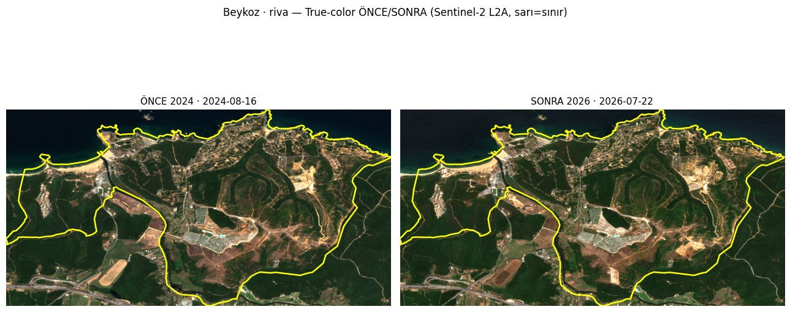

# BEYKOZ GÖRÜNTÜ FABRİKASI + RİVA BORCU · CC-TT-MAP MAP34

**Tarih:** 2026-07-28 · **Kaynak:** Sentinel-2 L2A true-color (visual/TCI 10m, ÖNCE 2024-08-16 / SONRA 2026-07-22, aynı-kaynak) · **Kanon-içi vaka** · fizik-blok · $0

> **Açığı kapatıyoruz:** 'resim çekmiyoruz' eleştirisine cevap — **gözle-görülür** ÖNCE/SONRA true-color karo katmanı. 14 karo `beykoz_vaka/karolar/`.

## 🔵 FİZİK-SINIR BLOĞU
- TCI değer-aralığı [0,255] clamp uygulandı (taşan-piksel yok). Sahne bulut<%8, aynı-mevsim (yaz), aynı-kaynak (S2-L2A) → ÖNCE/SONRA kıyaslanabilir (kaynak-karıştırma-yok).

## PART-1 — TRUE-COLOR KARO ÜRETİMİ (14 karo)

| Grup | Karolar |
|---|---|
| Sıcak-10 | ortacesme, yalikoy, camlibahce, pasabahce, kavacik, goztepe, goksu, merkez, cubuklu, gumussuyu |
| Riva-borcu | riva |
| Özel | incirkoy, BEY15_942_947 (nokta), Kundura_Tekel (nokta) |

Her karo: ÖNCE 2024 | SONRA 2026 yan-yana, **sarı=mahalle-sınırı** (nokta-pencerede +). `beykoz_vaka/karolar/karo_<ad>.png`

## PART-2 — ★ RİVA TAM-PAKET (4-tur borç kapatıldı)

| Ölçüm | Sonuç | Yorum |
|---|---|---|
| Landsat NDVI (1985-2015) | 0,59→0,61 (net +0,02) | stabil-orman, conversion-yok |
| Radar-ACD (2024↔2026) | VV-artış **%0,5** (≈sıfır) | inşaat-sinyali YOK |
| WC/NDBI | orman %63,5 / NDBI-yapı %4,4 / ⬜ | kırsal-N/A |
| **True-color 2024→2026** | mevcut konut-kompleksi + doğu çıplak-alan VAR; **belirgin YENİ-şantiye görünmüyor** | görsel ölçümlerle uyumlu |

**RİVA KARARI:** Dört bağımsız-ölçüm (NDVI + radar + WC + görsel) **oybirliğiyle: Riva'da henüz aktif-yeni-inşaat YOK.** Bu, F2'nin **'Riva sermaye→inşaat 2026-27'** öngörüsünün **ÖN-ÖLÇÜMÜdür**: t0 (henüz-başlamamış) tespit edildi → 2027'de NDVI-kaybı/radar-artış/şantiye başlarsa **öngörü doğrulanır**, başlamazsa **yanlışlanır**. Riva artık yıllık-izlemede.

## PART-3 — RADAR-ACD SICAK-10 (MAP30 yöntemi genişletildi)

| Mahalle | VV-artış% | medyan-VV | eğim° | değerlendirme |
|---|---|---|---|---|
| ortacesme | 3.5 | -2.98 | 13.9 | 🔴 LAYOVER-şüphe |
| yalikoy | 3.1 | -2.48 | 9.6 | ⬜ zayıf/gürültü |
| camlibahce | 0.1 | -4.15 | 10.9 | ⬜ zayıf/gürültü |
| pasabahce | 11.5 | -0.63 | 11.2 | 🟡 koherent |
| kavacik | 1.2 | -10.03 | 7.5 | ⬜ zayıf/gürültü |
| goztepe | 11.5 | -1.86 | 12.0 | 🔴 LAYOVER-şüphe |
| goksu | 10.3 | -0.86 | 7.6 | 🟡 koherent |
| merkez | 11.3 | -0.44 | 12.7 | 🔴 LAYOVER-şüphe |
| cubuklu | 6.9 | -3.94 | 11.3 | ⬜ zayıf/gürültü |
| gumussuyu | 11.9 | -0.55 | 14.5 | 🔴 LAYOVER-şüphe |

**Yorum:** Sıcak-10'un hiçbiri 'temiz-aday' (medyan-VV>0) değil — MAP30 layover-dersini doğruluyor. En-az-gürültülü: Paşabahçe/Göksu/Merkez/Gümüşsuyu (artış>10%, medyan~0) ama hepsi dik-arazi-şüpheli. **Radar standalone-detektör değil, HAKEM** (MAP30 doktrini korunur).

## GÖRSEL GÖZLEM (incelediklerim)
- **Riva:** mevcut konut-kompleksi (merkez grid) + doğu çıplak-alan; 2024→2026 belirgin-değişim-yok.
- **BEY15 (Çubuklu 942-947):** düşük-yoğunluk konut+ağaç; 2026'da merkez-sağ bir yapı daha-belirgin ama **10m parsel-düzeyi çözemiyor** (BEY-15 'pencere-altı' teyidi).
- Diğer 12 karo dosyada; sunum/inceleme için hazır.

## SONUÇ
Görsel-kanıt katmanı kuruldu (14 ÖNCE/SONRA karo). **Riva borcu kapatıldı: 4-ölçüm-oybirliği inşaat-YOK = F2-öngörüsünün t0'ı.** Radar-ACD sıcak-10'a genişledi, HAKEM-doktrini korundu. Görsel + NDVI + radar + (bekleyen OPERA) = çok-katmanlı-kanıt.

---
*CC-TT-MAP · $0 · A04 · kanon-içi (S2-L2A, ÖNCE/SONRA aynı-kaynak) · fizik-sınır-bloğu · SİLME-YOK · Kopya K24a. Karolar: beykoz_vaka/karolar/ (14 PNG).*