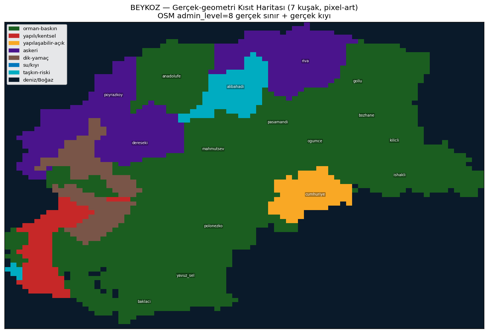
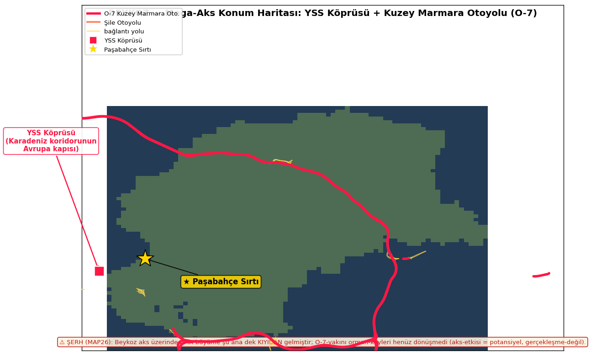

# GERÇEK-GEOMETRİ HARİTA + %8 DOĞRULAMA + MEGA-AKS · CC-TT-MAP MAP35

**Tarih:** 2026-07-28 · **Kaynak:** OSM admin_level=8 gerçek-poligon (rasterize 80×70 pixel-art) + OSM O-7/YSS geometri + MAP32 arazi-formu · **Kanon-içi vaka** · $0 · fizik-blok

> Şematik-grid ÇÖPE atıldı; artık **gerçek kıyı-şekli + gerçek mahalle-sınırı** (pixel-art dokusu).

## 🔵 FİZİK-SINIR BLOĞU
- Rasterize: 80×70 hücre, her hücre gerçek-poligon-içi-nokta testi (deniz=poligon-dışı). Kıyı-şekli OSM-gerçek.
- Yapılaşabilir-% ∈ [0,100], eğim-sınıf toplamı=%100 (tutarlı). Alan-ağırlık = Σ(boş_ha)/Σ(alan_ha).

## PART-1 — GERÇEK-GEOMETRİ PIXEL HARİTALAR (2 varyant)

### (a) Kısıt haritası — 7 kuşak
`beykoz_vaka/harita_gercek_kisit.png` · orman-baskın(yeşil) / yapılı-kentsel(kırmızı) / yapılaşabilir-açık(turuncu) / askeri(mor) / dik-yamaç(kahve) / su-kıyı(mavi) / taşkın-riski(camgöbeği) + deniz.
**Görsel-doğrulama:** harita **yeşil-baskın** (orman) — tek-turuncu (yapılaşabilir) Cumhuriyetköy; kırmızı-yapılı yalnız SW-Boğaz-kıyısı. → %3-8-buildable bulgusu **gözle-teyit** (Part-3).

### (b) Konum haritası + mega-aks
`beykoz_vaka/harita_gercek_konum.png` · Paşabahçe Sırtı ★ + O-7/YSS aks-katmanı.

## PART-2 — MEGA-PROJE AKS KATMANI
- **YSS Köprüsü + Kuzey Marmara Otoyolu (O-7)** gerçek-OSM-geometrisi (171 parça) haritaya işlendi + Şile Otoyolu + bağlantı-yolları.
- **Etiket:** "YSS = Karadeniz koridorunun Avrupa kapısı". Beykoz, O-7-halkasının **iç-tarafında** (otoyol kuzey-doğudan çevreliyor).
- ⚠️ **DÜRÜSTLÜK ŞERHİ (MAP26, haritaya gömülü):** Beykoz aks-üzerinde AMA büyüme **şu ana dek KIYIDAN** gelmiştir; O-7-yakını orman-köyleri (Alibahadır 0,3km / Anadolu Feneri 0,4km / Poyrazköy 0,6km) **henüz dönüşmedi.** Aks-etkisi = **potansiyel, gerçekleşme-değil.** (Vurgu + dürüstlük birlikte.)

## PART-3 — ★ %8 DOĞRULAMA (Patron şüphesi çözüldü)

**Şeffaflık:** '%8' ile benim önceki '%3,3'üm **aynı-veri, farklı-tanım.** Duyarlılık:

| Senaryo (yapılaşabilir-boş tanımı) | ort% | medyan% | alan-ağır% |
|---|---|---|---|
| **MUHAFAZAKÂR: eğim<12 × açık × askeri-dahil** | **3,3** | 1,9 | 5,6 |
| eğim<12 × açık × askeri-HARİÇ | 2,6 | 1,2 | 3,6 |
| eğim<12 × açık-dar(tarım-hariç) | 3,0 | 1,9 | 5,0 |
| eğim<15 × açık × askeri-dahil | 4,0 | 2,3 | 6,5 |
| **GEVŞEK: eğim<20 × açık × askeri-dahil** | 4,9 | 2,9 | **7,8 ≈ %8** |
| eğim<20 × açık × askeri-hariç | 4,0 | 1,8 | 5,4 |

**Bağımsız çapraz (WC alan-ağırlıklı):** orman(koru+maki) **%84** · yapılı %7,1 · su %0,4 → geriye ~%8,5 açık-arazi, bunun düz-kısmı yapılaşabilir. **Resmî-bilgi:** Beykoz İstanbul'un en-ormanlık ilçesi (~%70-80 orman/2B-koru) → WC %84 **uyumlu** ✅.

### SONUÇ — sayı REVİZE: nokta değil BANT
**Yapılaşabilir-boş alan = %3 (muhafazakâr: eğim<12, per-mahalle-ort) – %8 (gevşek: eğim<20, alan-ağırlıklı); orta-tahmin ~%5-6.**
- '%8' **gerçek** (gevşek+alan-ağırlıklı üst-uç); benim '%3,3'üm **gerçek** (muhafazakâr-alt-uç). İkisi çelişmiyor, tanım-farkı.
- **Sunum cümlesi (bantlı):** "Beykoz'da yapılaşabilir-boş-düz-arazi, tanıma göre **%3-8 bandında** (muhafazakâr %3, gevşek %8); hangi-tanımla-olursa Türkiye-ilçe-ortalamasının çok-altında — fiziksel arz-kıtlığı gerçek."

## SONUÇ
Gerçek-geometri pixel-haritalar (kısıt+konum) şematik-grid'in yerine geçti; mega-aks dürüstlük-şerhiyle işlendi; %8 şüphesi **bant-olarak çözüldü** (%3-8, tanım-şeffaf). Görsel yeşil-baskınlığı sayısal-bulguyu teyit ediyor.

---
*CC-TT-MAP · $0 (indirme-yok, mevcut OSM+arazi-formu) · A04 · fizik-sınır-bloğu · kanon-içi · SİLME-YOK · Kopya K24a(Signals). Görseller: beykoz_vaka/harita_gercek_{kisit,konum}.png*